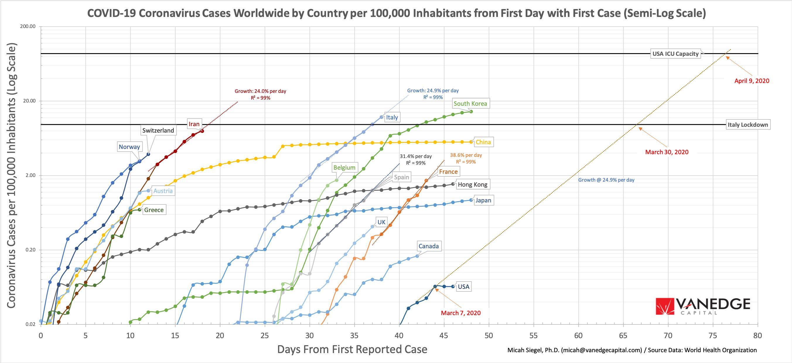
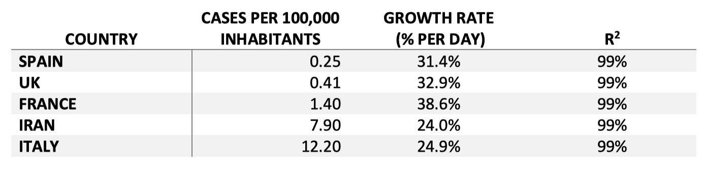

# Predicting the trajectory of the 2019 Coronavirus

I used primary data from the World Health Organization to predict the trajectory of the 2019 Coronavirus outbreak on a country-by-country basis. I normalized the number of cases in each country to the population of that country. This resulted in a normalized number of cases per 100,000 inhabitants for each country for each day.

Using the date of the first confirmed coronavirus case in each country as its day 0, I tracked the growth by day in normalized coronavirus cases per 100,000 inhabitants, from the earliest known start of the epidemic in each country.

## Summary

1. The 2019–20 coronavirus outbreak is at an inflection point.

2. The data strongly suggests that the number of coronavirus cases grows exponentially in countries that do not mandate quarantines, restrictions on travel and public gatherings, and closing of schools, universities and workplaces (“Social Distancing”).

3. The number of coronavirus cases compounds at more than 25% per day in countries that do not mandate social distancing. This behavior is consistent across Iran, Italy, Spain, France, and the UK, each measured independently from the date of the first case in that country, with root-mean-square accuracy R^2 > 99%.

4. The highly precise exponential growth strongly suggests that the growth in these cases is due to an underlying biological phenomenon (e.g. virus transmission) rather than due to an increase in the availability of tests or the number of tests performed.

5. At a density of approximately 9.7 coronavirus cases per 100,000 inhabitants, Italy mandated on 3/8/20 a complete regional lock-down, with movement restrictions applying to about 16 million people (25% of the population of Italy). The following day, on 3/9/20, the lock-down was extended to the entire country (100% of the population of Italy).
   

## Predictions

1. US — I predict that the US density will reach the Italian threshold of 9.7 US coronavirus cases per 100,000 US inhabitants by March 30, 2020. This threshold density is equal to the density of cases when Italy implemented a regional lock-down that affected 25% of its population.

2. US — I predict that the density could reach 87 US coronavirus cases per 100,000 US inhabitants by April 9, 2020, in some regions, unless further social controls are adopted. I computed 87 cases per 100,000 inhabitants as the threshold density at which all currently unoccupied intensive care unit (ICU) beds would be occupied by a US person who is infected with coronavirus and has severe, life-threatening symptoms. In other words, no regional beds to house patients who are severely ill.
   

All of these numbers are an underestimate of the actual numbers with the US numbers being one of the most underestimated. However, this underestimate won’t affect the March 30 or April 9 prediction much (moving them sooner by a few days) since the underestimate is a multiplicative factor whereas the growth is exponential.

## Conclusions

1. I believe that the US is likely to mandate substantially more invasive quarantines, restrictions on travel and public gatherings, and closing of schools, universities and workplaces (“Social Distancing”) in the near term when ICU beds are unavailable and patient deaths begin to rise precipitously.

2. This will affect a significantly larger percentage of the US population than is currently affected by voluntary social distancing, including younger people in the workforce who might be asymptomatic but who are forced to work from home and curtail spending and travel.

3. The number of people affected in the US will increase dramatically within the next three weeks. The overall slowdown in economic activity is likely to be more severe and of longer duration than is currently anticipated.

4. Due to the market's perception of an economic slowdown, companies need to shift from a revenue growth mentality to a capital preservation mentality. Markets will reward profitability and strong balance sheets over growth. Cash will be king.

   

   

   

   

### Message to all start-up companies in particular:

- Focus on cashflow. Become profitable if you can. Expect to be very flexible on valuation if you need to raise capital. Raising capital may become impossible over the next few quarters for some companies.
- Anticipate missing quarterly revenue targets due to customers delaying orders and/or cancelling new projects. Rebuild an operating plan that is robust to significant cash shortfall from diminished revenues.
- Immediately look for ways to reduce your company’s expense structure to extend its cash runway (including delayed hiring plans but also implementing RIFs now).
- Sacrifice growth for runway. “Must be present to win.”

## Method

The data was compared on a semi-log plot to identify exponential growth in cases. This data is shown in the figure below. The horizontal axis is days from the first reported case (T0) for each country. The vertical axis is the the number coronavirus patients per 100,000 inhabitants, on a Log scale. Each country is a different color line.

We use a semi-log plot for two reasons. First, exponential growth appears as a straight line on a semi-log plot. The human eye is very good at identifying straight lines. Second, a semi-log plot allows one to compare similar growth rates over time across widely different base rates (in this case, from 0.02 cases to 200 cases per 100,000 inhabitants). Lines with equal slopes on a semi-log plot have equal growth rates irrespective of their absolute magnitude or position in time.

The data strongly suggests that the number of coronavirus cases grows exponentially in countries that do not mandate quarantines, restrictions on travel and public gatherings, and closing of schools, universities and workplaces (“Social Distancing”). The most striking differences (between China, Hong Kong, and Japan versus the rest of the world) confirm the hypothesis of person-to-person transmission as the driver of exponential growth since the countermeasures they have taken specifically limit this and do nothing to change the detection rate.

I fit the growth in coronavirus cases to exponential curves in five countries. I found that the number of coronavirus cases compounds at approximately 25% per day in countries that do not mandate social distancing. This behavior is consistent across Iran, Italy, Spain, France, and the UK, each measured independently from the date of the first case in that country, with root-mean-square accuracy R^2 > 99%.

